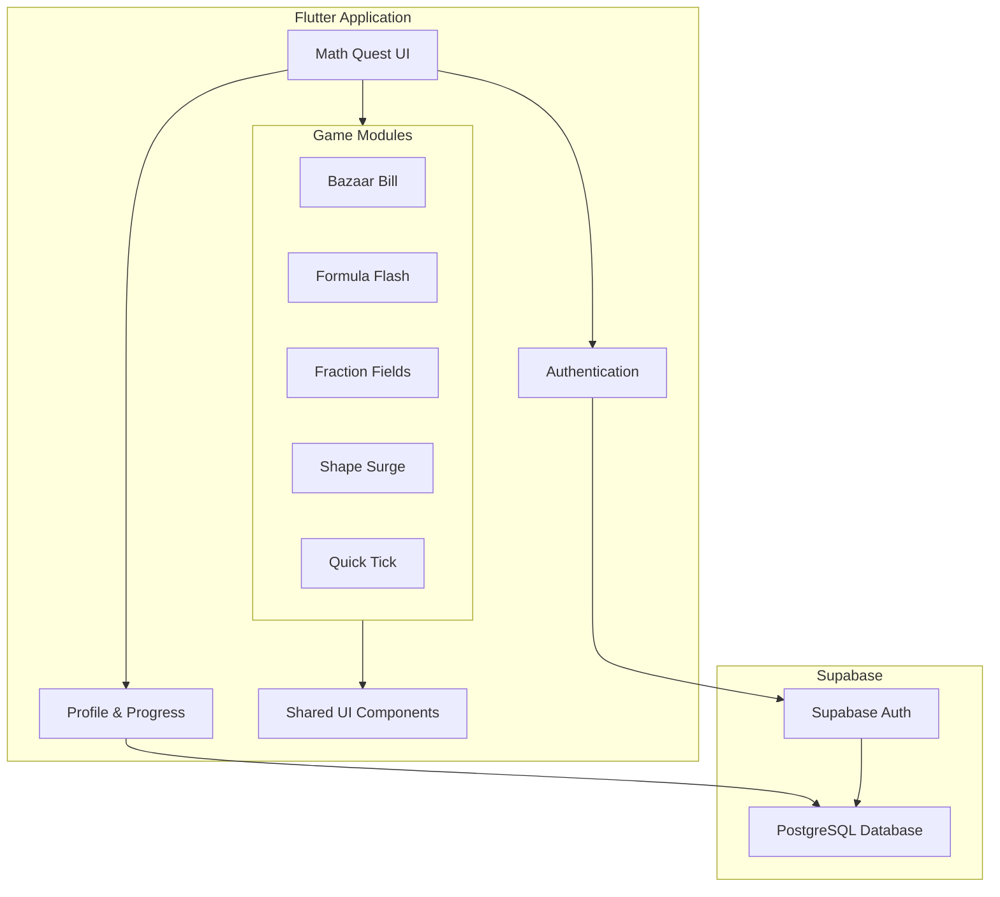
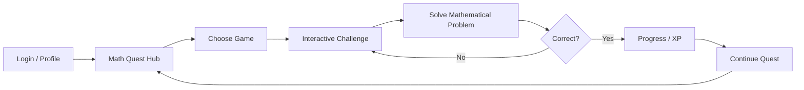

<div align="center">

# MATH QUEST

### **Gamified Mathematics Learning Through Interactive Mini-Games**

[](https://flutter.dev)
[](https://dart.dev)
[](https://supabase.com)
[](https://flutter.dev)

</div>

<br />

---

## 🧭 Overview

**MATH QUEST** is an interactive educational platform that transforms mathematics practice into a collection of game-based challenges.

Instead of treating mathematics as a sequence of static worksheets, the application uses **interactive mini-games, immediate feedback, progression, and an adventure-style interface** to make repeated practice more engaging.

The application is built with **Flutter** and integrates **Supabase** for cloud-backed application functionality, while custom UI components, visual assets, animations, and game modules provide the interactive learning experience.

The platform currently includes five mathematical game modules:

* 🧾 **Bazaar Bill**
* ⚡ **Formula Flash**
* 🧩 **Fraction Fields**
* 🔷 **Shape Surge**
* ⏱️ **Quick Tick**

Each module focuses on a different mathematical skill while contributing to the larger Math Quest experience.

<br />

---

## 🎯 Core Objectives

<table width="100%" cellpadding="10" cellspacing="0">
<tr>
<td><b>🎮 Game-Based Learning</b></td>
<td>Convert mathematical practice into short, interactive challenges.</td>
</tr>

<tr>
<td><b>🧠 Skill Reinforcement</b></td>
<td>Provide repeated practice across different mathematical concepts.</td>
</tr>

<tr>
<td><b>⚡ Immediate Interaction</b></td>
<td>Allow learners to actively solve, respond, and receive feedback.</td>
</tr>

<tr>
<td><b>📈 Progression</b></td>
<td>Use XP and level progression to create a sense of continuous advancement.</td>
</tr>

<tr>
<td><b>🌌 Immersive Interface</b></td>
<td>Combine educational content with an adventure-oriented visual experience.</td>
</tr>
</table>

<br />

---

## 🕹️ Game Modules

### 🧾 Bazaar Bill

A mathematics challenge built around **real-world purchasing and billing scenarios**.

Players interact with a simulated marketplace environment where mathematical reasoning is applied to everyday transactions.

**Focus:**

* Arithmetic
* Money calculations
* Quantitative reasoning
* Real-world mathematical application

---

### ⚡ Formula Flash

A fast-paced mathematical challenge focused on **formula recognition and calculation**.

Players must identify and apply the appropriate mathematical relationship under time or interaction pressure.

**Focus:**

* Formula recall
* Calculation
* Speed
* Mathematical fluency

---

### 🧩 Fraction Fields

A dedicated game module for practicing **fractions through interactive challenges**.

The module moves fraction practice away from conventional written exercises and into a game-oriented environment.

**Focus:**

* Fraction representation
* Fraction operations
* Comparison
* Mathematical reasoning

---

### 🔷 Shape Surge

A visual mathematics game centred around **shapes and geometry**.

Players interact with geometric elements while solving challenges involving spatial and geometric reasoning.

**Focus:**

* Shapes
* Geometry
* Spatial reasoning
* Visual mathematics

---

### ⏱️ Quick Tick

A time-oriented mathematical mini-game designed around **clock and time-based reasoning**.

**Focus:**

* Time interpretation
* Clock reading
* Quick reasoning
* Accuracy under interaction pressure

<br />

---

## 🏗️ Application Architecture



The application is structured as a Flutter client with separate game modules, shared UI components, authentication/profile functionality, and Supabase-backed services. The repository includes dedicated Dart files for the individual games as well as shared screens such as login, profile, splash, and reusable UI components.

---

## ⚙️ Technology Stack

<table width="100%" cellpadding="10" cellspacing="0">
<tr>
<td><b>Frontend</b></td>
<td>Flutter</td>
</tr>

<tr>
<td><b>Language</b></td>
<td>Dart</td>
</tr>

<tr>
<td><b>Backend / Database</b></td>
<td>Supabase / PostgreSQL</td>
</tr>

<tr>
<td><b>Authentication</b></td>
<td>Supabase Authentication</td>
</tr>

<tr>
<td><b>Typography</b></td>
<td>Google Fonts</td>
</tr>

<tr>
<td><b>Graphics</b></td>
<td>Flutter SVG + custom image assets</td>
</tr>

<tr>
<td><b>Loading / Feedback</b></td>
<td>Flutter Spinkit</td>
</tr>

<tr>
<td><b>Media</b></td>
<td>Image Picker</td>
</tr>
</table>

The current dependency configuration includes `supabase_flutter`, `google_fonts`, `flutter_svg`, `flutter_spinkit`, and `image_picker`, alongside Flutter's standard Material and testing packages.

<br />

---

## 🔐 Authentication & User Experience

Math Quest includes an authentication flow integrated with Supabase and provides dedicated screens for login and user profiles. The application initializes Supabase before launching the Flutter interface and connects the main application flow with authentication and profile functionality.

The application also includes:

* 🔑 User authentication
* 👤 Profile interface
* 🎮 Game selection hub
* 📊 Progress-oriented experience
* 🧭 Navigation between learning modules
* 🎨 Custom visual theme
* 📱 Cross-platform Flutter support

<br />

---

## 🎨 Design System

Math Quest uses a **dark navy and gold visual identity** designed to give the application an adventure-game aesthetic rather than the usual tragic combination of white background + Times New Roman + educational trauma.

The application uses:

* Deep navy backgrounds
* Gold/yellow accent elements
* Custom game artwork
* Google Fonts typography
* Custom game cards
* Illustrated learning environments
* Responsive Flutter layouts

The launcher configuration also uses a deep navy background and the project's custom Math Quest logo.

<br />

---

## 📂 Repository Structure

```text
Math-Quest-App/
│
├── android/                  # Android platform configuration
├── ios/                      # iOS platform configuration
├── linux/                    # Linux platform configuration
├── macos/                    # macOS platform configuration
├── windows/                  # Windows platform configuration
├── web/                      # Web platform configuration
│
├── assets/
│   ├── currency/             # Currency-related game assets
│   ├── 1.png ... 8.png       # Game / UI assets
│   ├── BAZAARBILL.png
│   ├── FRACTION FIELD LOAD.png
│   ├── FORMULA FLASH LOAD.png
│   ├── field_day.png
│   ├── field_dusk.png
│   ├── field_night.png
│   ├── clock_bg.png
│   ├── crop.png
│   ├── drawer.png
│   └── mathquestlogo.png
│
├── lib/
│   ├── games/
│   │   ├── bazaar_bill.dart
│   │   ├── formula_flash.dart
│   │   ├── fraction_fields.dart
│   │   ├── shape_surge.dart
│   │   └── quick_tick.dart
│   │
│   ├── login.dart
│   ├── profile_screen.dart
│   ├── splash_screen.dart
│   ├── supa.dart
│   ├── ui_widgets.dart
│   └── main.dart
│
├── test/                     # Flutter tests
├── pubspec.yaml              # Dependencies & asset configuration
├── analysis_options.yaml     # Dart analysis configuration
└── README.md
```

The repository is a standard multi-platform Flutter project with dedicated platform directories and a `lib` source tree containing the application entry point, authentication, profile, shared UI, and individual game modules.

---

## 🚀 Setup & Execution

### Prerequisites

Install:

* Flutter SDK
* Dart SDK compatible with the project's Flutter/Dart environment
* Android Studio / Xcode / VS Code as required by your target platform
* A configured Supabase project

The current project specifies a Dart SDK constraint of `^3.11.4`.

### Clone Repository

```bash
git clone https://github.com/AayushRahate07/Math-Quest-App.git
cd Math-Quest-App
```

### Install Dependencies

```bash
flutter pub get
```

### Run the Application

For a connected device or emulator:

```bash
flutter run
```

For a specific target:

```bash
flutter run -d chrome
```

```bash
flutter run -d windows
```

<br />

---

## 🧪 Testing

Flutter's testing framework is included in the project configuration.

Run:

```bash
flutter test
```

Static analysis can be performed using:

```bash
flutter analyze
```

For a production build:

```bash
flutter build apk
```

or:

```bash
flutter build web
```

<br />

---

## 🔄 Learning Flow



The intended interaction model is simple:

**Choose → Play → Solve → Receive Feedback → Progress**

Because apparently putting arithmetic behind a quest narrative is what humanity needed to rediscover the concept of motivation.

---

## 📌 Key Features

* 🎮 **Five interactive mathematics mini-games**
* 🧾 Real-world billing and calculation scenarios
* 🧩 Fraction-based challenges
* 🔷 Geometry and shape-based interaction
* ⏱️ Time and clock-based challenges
* ⚡ Formula-based rapid problem solving
* 👤 User profile functionality
* 🔐 Supabase authentication integration
* 📈 XP-oriented progression
* 🎨 Custom adventure-themed interface
* 📱 Multi-platform Flutter architecture
* 🖼️ Custom game assets and loading screens

The main application registers all five game modules and presents them through reusable game cards in the Math Quest interface.

---

## 🛠️ Development Notes

The project is currently configured as a Flutter application with version `1.0.0+1` and a Dart SDK requirement of `^3.11.4`. Supabase is initialized during application startup, while game modules are maintained as separate Dart files under `lib/games/`.

The asset pipeline includes dedicated visual resources for the individual games, environments, loading screens, currency interactions, and the main application branding.

---

## 🗺️ Future Scope

Potential extensions to the platform include:

* 📊 Detailed learner analytics
* 🏆 Achievement and badge system
* 🥇 Competitive leaderboards
* 🔥 Daily learning streaks
* 📚 Difficulty progression
* 👨‍🏫 Teacher / educator dashboard
* 📈 Topic-wise performance tracking
* ☁️ Expanded cloud synchronization
* 🎯 Adaptive question difficulty
* 🌐 Expanded curriculum coverage

---

## 📜 License

This project currently does not specify a separate open-source license in the repository.

---

<div align="center">

### **MATH QUEST**

**Learn Mathematics. Complete Challenges. Level Up.**

Built with Flutter & Supabase.

<br />

• MATH QUEST • AAYUSH RAHATE •

</div>
